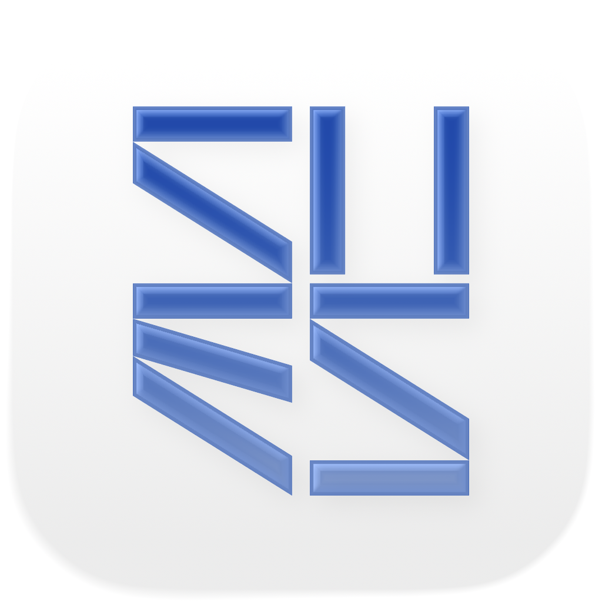

<p align="center">
  
</p>

# My SUES

[简体中文](docs/README_zh-Hans.md) | **English**

My SUES is a campus life assistant app created by student developers from Shanghai University of Engineering Science (SUES). Designed to provide SUESers with more convenient educational information query services, supporting both iOS and Android.

## ✨ Features

- **📅 Schedule Query**: Check course schedules anytime, anywhere. Supports not only online educational administration system data synchronization but also provides an intuitive weekly view.
- **📊 Grade Query**: Quickly query grades and GPA for each semester to keep track of learning progress.
- **📝 Exam Information**: Check exam times and location arrangements, never miss an exam again.
- **📄 PDF Import**: Supports importing PDF schedules issued by the school for offline viewing.
- **🎨 Personalization**: Supports Dark Mode, customizable fonts, creating an exclusive app experience.
- **🔒 Secure Login**: Built-in WebView for logging into the educational administration system, maintaining sessions via Cookie management, safe and convenient.

## 🛠️ Tech Stack

This project is developed using the Google [Flutter](https://flutter.dev) framework.

### Key Dependencies
- **Networking**: [dio](https://pub.dev/packages/dio), [cookie_jar](https://pub.dev/packages/cookie_jar)
- **PDF Processing**: [syncfusion_flutter_pdf](https://pub.dev/packages/syncfusion_flutter_pdf)
- **WebView**: [webview_flutter](https://pub.dev/packages/webview_flutter)
- **Local Storage**: [shared_preferences](https://pub.dev/packages/shared_preferences)
- **File Picker**: [file_picker](https://pub.dev/packages/file_picker)

## 🚀 Quick Start

If you want to run this project locally, please ensure you have the Flutter development environment installed.

1. **Clone the project**
   ```bash
   git clone https://github.com/HsxMark/MySUES.git
   cd MySUES
   ```

2. **Install dependencies**
   ```bash
   flutter pub get
   ```

3. **Run the app**
   ```bash
   flutter run
   ```

## 📱 Platform Support

- **Android**: Android 5.0+
- **iOS**: iOS 11.0+

## ⚠️ Disclaimer

This project is an unofficial application developed by individual students for learning and exchange purposes only.
- All data in the application comes directly from the school's educational administration system. This project does not save any user account passwords.
- Do not use this project for any commercial purposes.

## 📜 License

This project follows open source licenses, please check the [LICENSE](LICENSE) file for details.